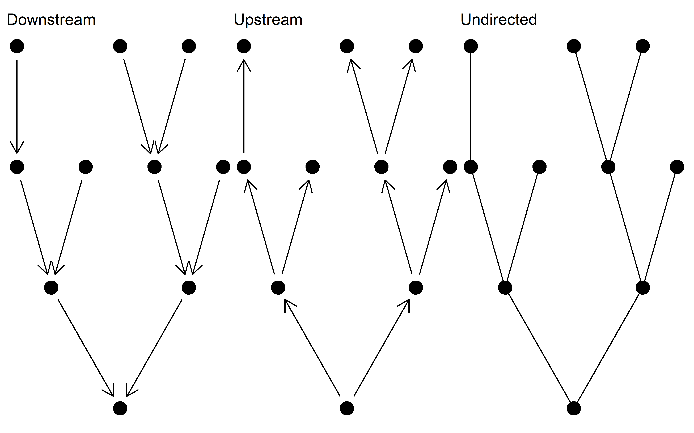
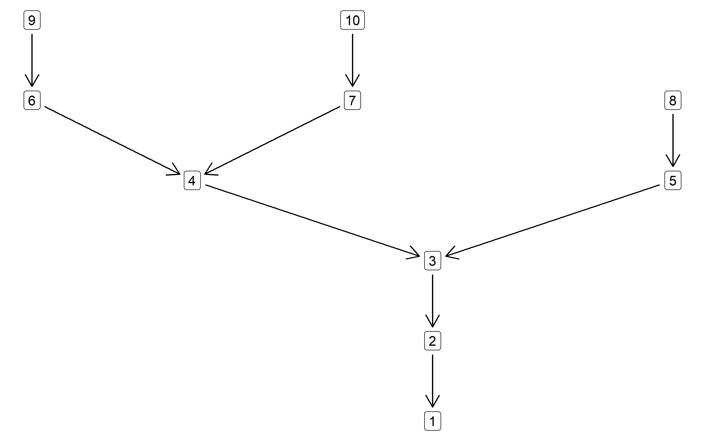
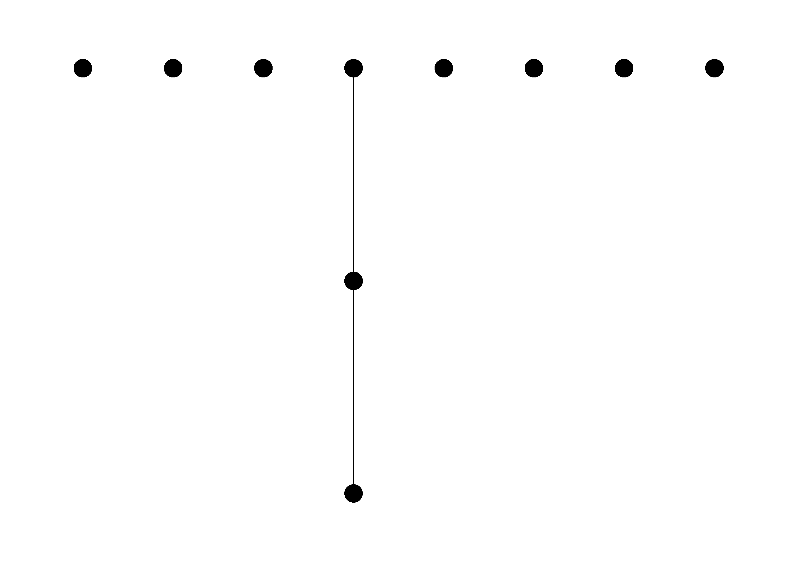
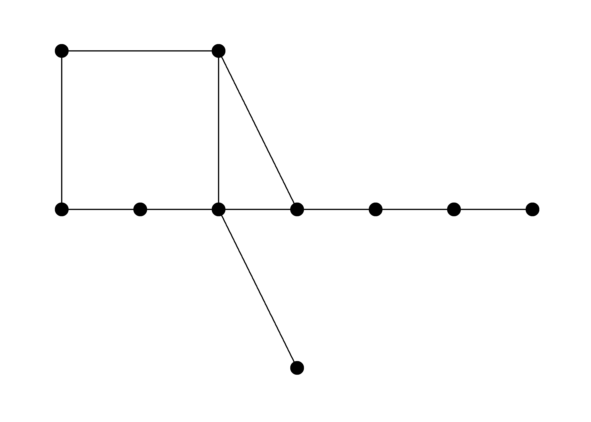
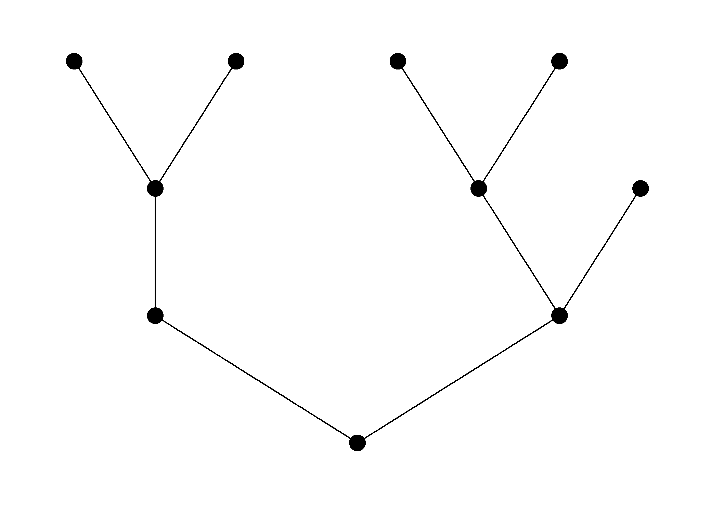
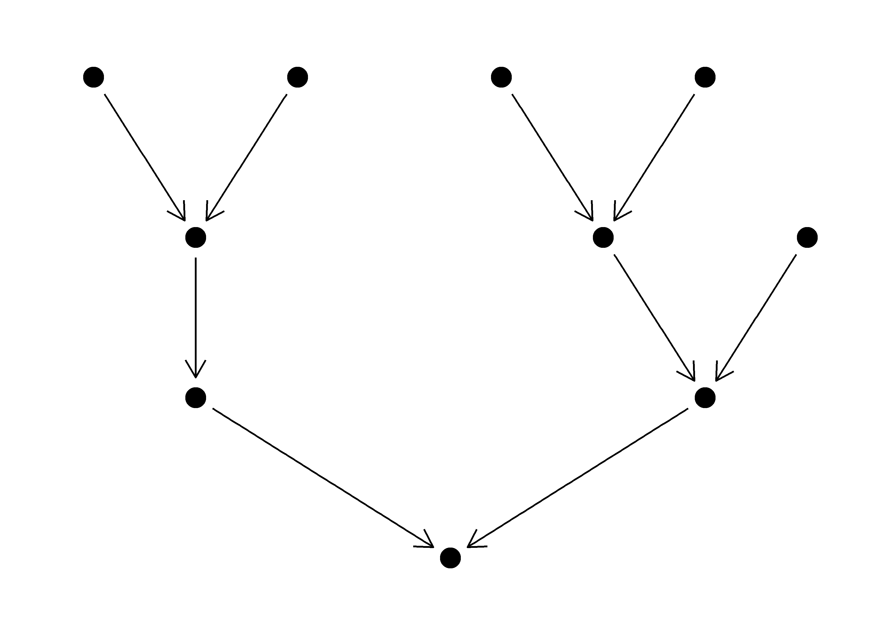

# SBN

<!-- badges: start -->
<!-- badges: end -->

The purpose of this package is to generate Stochastic Branching Networks
(SBNs), which are frequently used to represent the branching structure
of rivers in ecological models. The functions in this package rely
heavily on the [igraph](https://igraph.org/r/) package. See the [help
page](https://flee598.github.io/SBN/) for additional details.

The fundamental unit of the SBN package is a downstream directed
`igraph` object. The package contains functions for generating and
manipulating these networks. The functions *should* also work on river
networks generated in other packages, which have subsequently been
converted to `igraph` objects
(e.g. [OCNs](https://cran.r-project.org/web/packages/OCNet/vignettes/OCNet.html)).

Aside from downstream directed networks upstream directed and undirected
networks can be generated.

<!-- -->

### Installation

SBN is currently only accessible via the GitHub repo.

``` r
devtools::install_github("flee598/SBN")
```

### Generatting SBNs

``` r
library(SBN)
# generate an SBN with 10 nodes and a branching probability of 0.7
g <- sbn_create(10, 0.7)
g
#> IGRAPH 3d33bb5 D--- 10 9 -- 
#> + edges from 3d33bb5:
#> [1]  2->1  3->1  4->2  5->3  6->3  7->4  8->4  9->5 10->6
```

<!-- -->

### Basic manipulation

The SBN package has a handful of functions for basic manipulation of
networks.

``` r
# identify all headwater nodes
sbn_get_hw(g)
#>  7  8  9 10 
#>  7  8  9 10

# get all nodes downstream of node 10
sbn_get_downstream(g, 10)
#> [1] 6 3 1

# get all nodes upstream of node 2
sbn_get_upstream(g, 2)
#> [1] 4 7 8

# get the id of the outlet node
sbn_get_outlet(g)
#> 1 
#> 1

# get the node-to-node distance of an undirected network
sbn_to_mtx(g, method = "n2n_dist_undir")
#>    1 2 3 4 5 6 7 8 9 10
#> 1  0 1 1 2 2 2 3 3 3  3
#> 2  1 0 2 1 3 3 2 2 4  4
#> 3  1 2 0 3 1 1 4 4 2  2
#> 4  2 1 3 0 4 4 1 1 5  5
#> 5  2 3 1 4 0 2 5 5 1  3
#> 6  2 3 1 4 2 0 5 5 3  1
#> 7  3 2 4 1 5 5 0 2 6  6
#> 8  3 2 4 1 5 5 2 0 6  6
#> 9  3 4 2 5 1 3 6 6 0  4
#> 10 3 4 2 5 3 1 6 6 4  0

# downstream directed network to upstream directed network
sbn_change_dir(g, method = "rev")
#> IGRAPH 3d9a2e6 DN-- 10 9 -- 
#> + attr: name (v/c)
#> + edges from 3d9a2e6 (vertex names):
#> [1] 1->2  1->3  2->4  3->5  3->6  4->7  4->8  5->9  6->10
```

### Calculating Strahler order

Calculate the Strahler order of nodes in a network.

``` r
# Strahler order
sbn_strahler(g)
#>  1  2  3  4  5  6  7  8  9 10 
#>  3  2  2  2  1  1  1  1  1  1
```

### A note on plotting SBNs

For quick plotting I have generally used
[ggraph](https://www.data-imaginist.com/2017/ggraph-introduction-layouts/)
with the `tree` layout. As far as I can tell, the `tree` algorithm
doesn’t play nice with a downstream directed network, and therefore for
plotting purposes you need to reverse the network to an upstream
directed one and it works fine. It is a bit fiddly, but I haven’t found
any simple “out-of-the-box” alternative as of yet. Another option is to
generate your own node coordinates (as OCNet does), but I haven’t gotten
around to implementing that.

``` r
# Illustration of plotting an SBN using ggraph

library(SBN)
library(igraph)  # for layout_as_tree
library(ggraph)  # for ggplot2 style plotting

# generate an SBN
g <- sbn_create(10, 0.7)

# Attempt 1 ------------------------------------------------
# no layout defined - doesn't work
ggraph(g) +
  geom_node_point(size = 5) +
  geom_edge_link() +
  theme_graph()
```

<!-- -->

``` r
# Attempt 2 ------------------------------------------------
# try using layout_as_tree layout - doesn't work
l <- igraph::layout_as_tree(g, flip.y = FALSE)

ggraph(g, layout = l) +
  geom_node_point(size = 5) +
  geom_edge_link() +
  theme_graph()
```

<!-- -->

``` r
# Attempt 3 ------------------------------------------------
# reverse to upstream directed graph - works
g_rev <- sbn_change_dir(g, method = "rev")

# define layout
l <- igraph::layout_as_tree(g_rev, flip.y = FALSE)

# plot
ggraph(g_rev, layout = l) +
  geom_node_point(size = 5) +
  geom_edge_link() +
  theme_graph()
```

<!-- -->

``` r
# Attempt 4 ------------------------------------------------
# add downstream arrows - doesn't really serve any purpose..
ggraph(g_rev, l) +
  geom_node_point(size = 5) +
  geom_edge_link(arrow = arrow(length = unit(4, 'mm'), ends = "first"),
                 end_cap = circle(4, 'mm'),
                 start_cap = circle(4, 'mm')) +
  theme_graph()
```

<!-- -->
